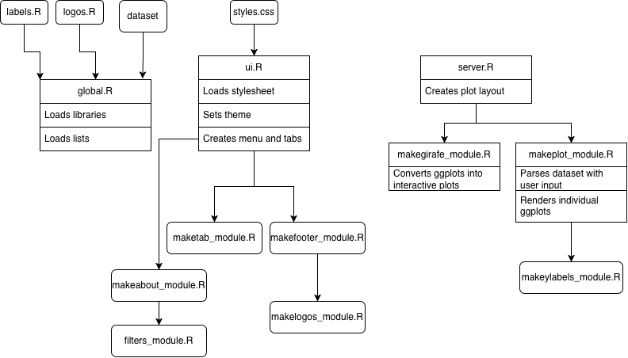

# Winter Pressures Dashboard

## Project Overview

Winter places significant pressure on primary and secondary care in the UK. ​General practice characteristics vary across practices and may impact hospital admissions​. This is particularly important for ACSCs (Ambulatory Care Sensitive Conditions e.g. Diabetes, Asthma etc) as the need for secondary care use can be prevented for these conditions by effective primary care​. Understanding the impact of general practice characteristics is important for improving resource allocation and planning​.

**Study protocol**: Zou M, Dawadi S, Pettigrew LM, et al. The relationship between general practice characteristics, case-mix, and secondary care attendances/admissions before and after the COVID-19 pandemic: Protocol for an OpenSAFELY cohort study. Wellcome Open Research 2025, 10:396. [doi.org/10.12688/wellcomeopenres.24356.1](https://doi.org/10.12688/wellcomeopenres.24356.1)

**Study GitHub repository**: [WinterPressuresDescriptive](https://github.com/opensafely/WinterPressuresDescriptive)

**Study leads**: Zoe Mengxuan Zou, Rachel Denholm; University of Bristol 

**Contributors**: Shrinkhala Dawadi, Ruth E Costello, Luisa M Pettigrew, Rosalind M Eggo, Emily Herrett, Venexia Walker, Marwa Al Arab, Michael Marks, Jonathan Sterne, Alex Walker, Jaidip Gill, John Macleod, Johnny Filipe, Heather Mah, Sebastian Bacon, Matt Curtis, Amir Mehrkar, Laurie Tomlinson, Ben Goldacre, Rohini Mathur, Edwin van Leeuwen 

**Dashboard author**: Nagat Guled 

**Dashboard reviewers**: Zoe Mengxuan Zou, Marwa Al Arab 

## Dashboard aims
The study results encompass 21 practice-level characteristics, eight outcomes and multiple model types. It is difficult to communicate these complex results with static figures alone. The aims are to:
- Develop a reusable interactive dashboard for visualisation
- Allow users to filter by associations of their interest
- **Enable stakeholders to explore and communicate findings**

> **Data notice:** The dashboard currently uses simulated, aggregated model-output data stored in [`WinterPressuresDashboard/data/`](./WinterPressuresDashboard/data/). It does not contain patient-level data. Real study outputs will only be incorporated after NHS England review and approval.

## Dashboard code structure



## How to use the code

The [Mastering Shiny](https://mastering-shiny.org/) book and the [Shiny for R Gallery](https://shiny.posit.co/r/gallery/) are great resources for getting started with Shiny.

[`dataset`](./WinterPressuresDashboard/data/dummy_model_output.csv): Currently contains the simulated model estimates used by the dashboard. Each row represents an estimate for a combination of outcome, cohort, population subgroup, practice-level characteristic and model type, including the incidence rate ratio (IRR) and confidence limits. To reuse the dashboard with another dataset, either retain the expected column names and coding or update the corresponding mappings and filtering logic in [`global.R`](./WinterPressuresDashboard/global.R), [`labels.R`](./WinterPressuresDashboard/R/labels.R) and [`makeplot_module.R`](./WinterPressuresDashboard/R/makeplot_module.R).

[**global.R**](./WinterPressuresDashboard/global.R): This is the main file of the code and should be kept short. Use this file to load in your dataset and initialise any variables. Replace [labels.R](./WinterPressuresDashboard/R/labels.R) with the variables in your own dataset mapped to your desired label names for the plots.

[**ui.R**](./WinterPressuresDashboard/ui.R): This file defines the layout of the app. Load your own stylesheet, and replace the title of the app and tab names. 

[`makeabout_module.R`](./WinterPressuresDashboard/R/makeabout_module.R): Defines the content displayed on the About tab, including the study overview, background, OpenSAFELY description, dashboard contents and usage instructions. To reuse the dashboard, replace the project-specific title, protocol, contributor information, background and instructions with content relevant to your own project.

[`maketab_module.R`](./WinterPressuresDashboard/R/maketab_module.R): This file is a function called in [ui.R](./WinterPressuresDashboard/ui.R). Change the widths of page elements as desired. 

[`filters_module.R`](./WinterPressuresDashboard/R/filters_module.R): This is called in [maketab_module.R](./WinterPressuresDashboard/R/maketab_module.R). It renders the filter panel on each page. Replace input titles and use your lists in [labels.R](./WinterPressuresDashboard/R/labels.R) as choices.

[`makefooter_module.R`](./WinterPressuresDashboard/R/makefooter_module.R): This file is called in [**ui.R**](./WinterPressuresDashboard/ui.R) and renders a footer with text and a scrolling logos animation. Change acknowledgement text to describe your own project. Update [`logos.R`](./WinterPressuresDashboard/R/logos.R) with a list of your own logos and reuse [`makelogos_module.R`](./WinterPressuresDashboard/R/makelogos_module.R) to render them.

[**server.R**](./WinterPressuresDashboard/server.R): This is the third of the three main files. In general, this file processes input from [**ui.R**](./WinterPressuresDashboard/ui.R) and generates output. In the case of this dashboard it uses the patchwork library to define the plot layout.

[`makeplot_module.R`](./WinterPressuresDashboard/R/makeplot_module.R): This file contains the data parsing and visualising logic. Replace the column names in this dataset with the column names in your own. Replace the interpretation sentences with ones that apply to your figures. This script adds an "exposure type" column to the dataset. Replace the variables (Practice characteristics and Patient case-mix) to render a graph with dynamic facets.

[`makeylabels_module.R`](./WinterPressuresDashboard/R/makeylabels_module.R): This is called in [makeplot_module.R](./WinterPressuresDashboard/R/makeplot_module.R) and makes the heading y axis labels bold. Replace the vectors as required.

## Running the dashboard locally

Install the required R packages listed in [`WinterPressuresDashboard/global.R`](./WinterPressuresDashboard/global.R).

From the repository root, run:

```r
shiny::runApp("WinterPressuresDashboard")
```

## Deployment

**The dashboard is deployed at**:

https://h4e5yf-nagat0guled.shinyapps.io/winterpressuresdashboard/

**To update the existing deployment**:
```r
rsconnect::deployApp("WinterPressuresDashboard")
```

The [`WinterPressuresDashboard/rsconnect/`](./WinterPressuresDashboard/rsconnect/) directory contains metadata linking the repository to the existing shinyapps.io application. Deployment requires an authorised shinyapps.io account configured locally. Tokens and secrets must never be committed to the repository.


